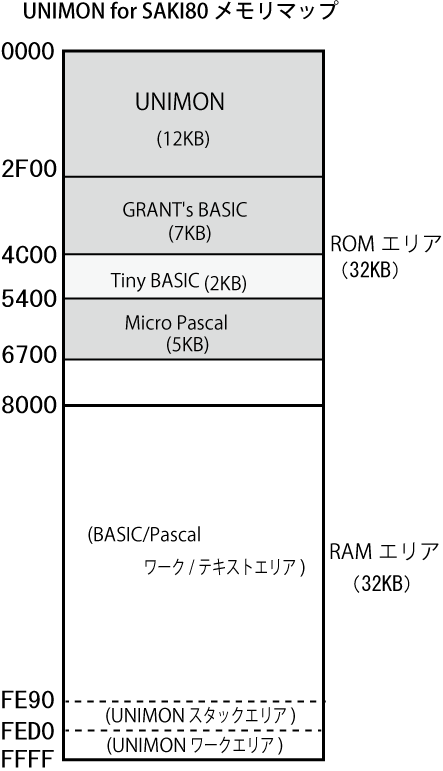
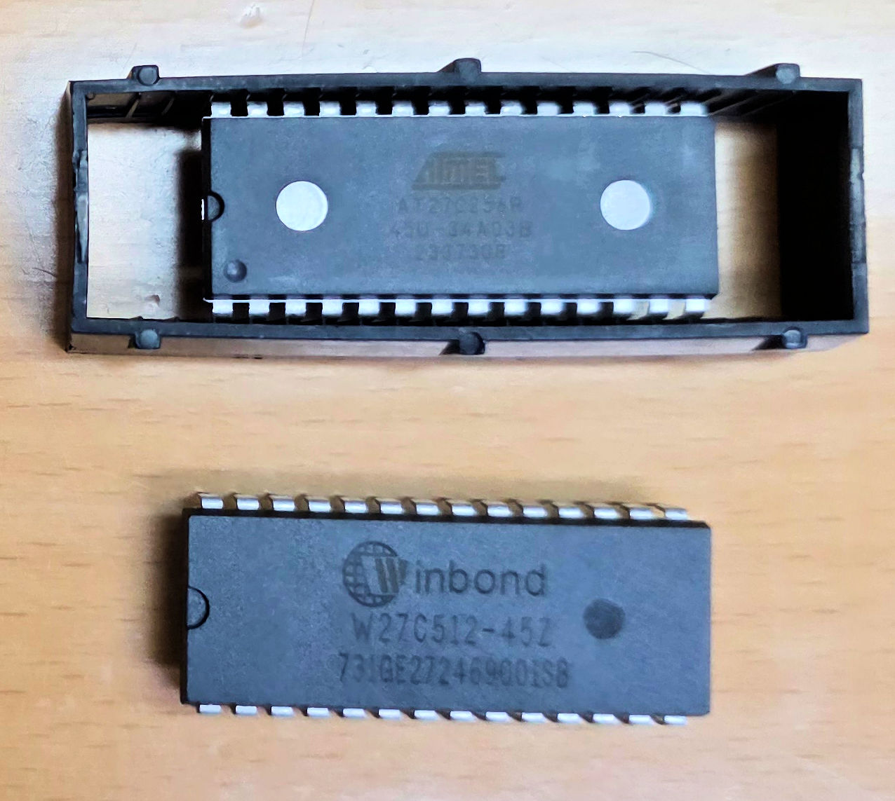
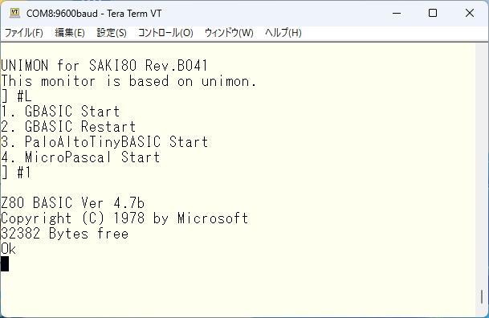
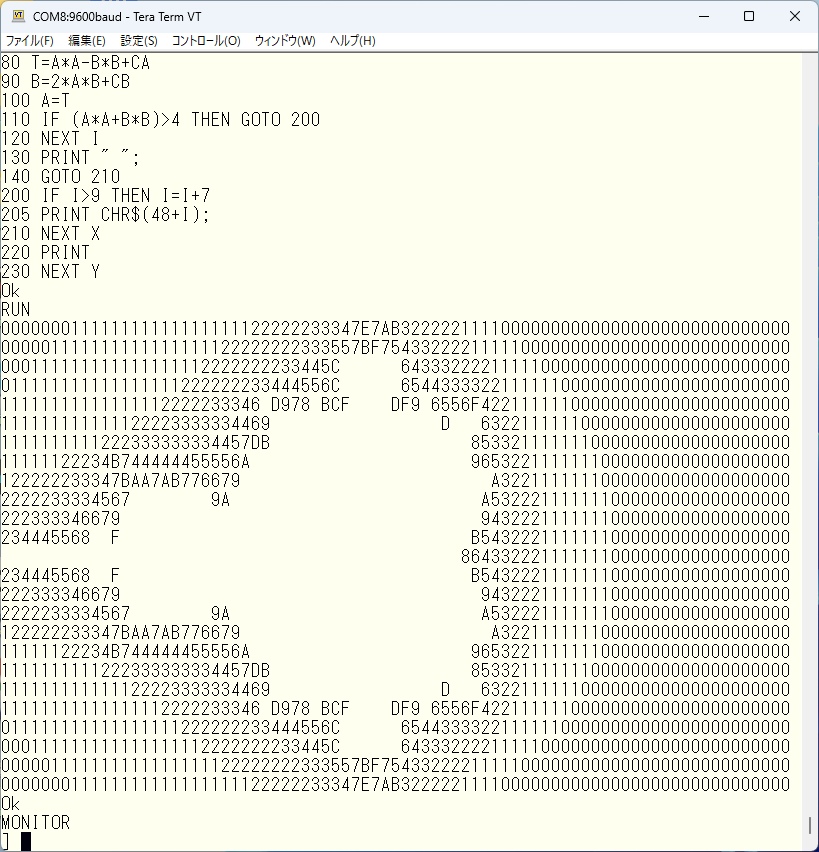
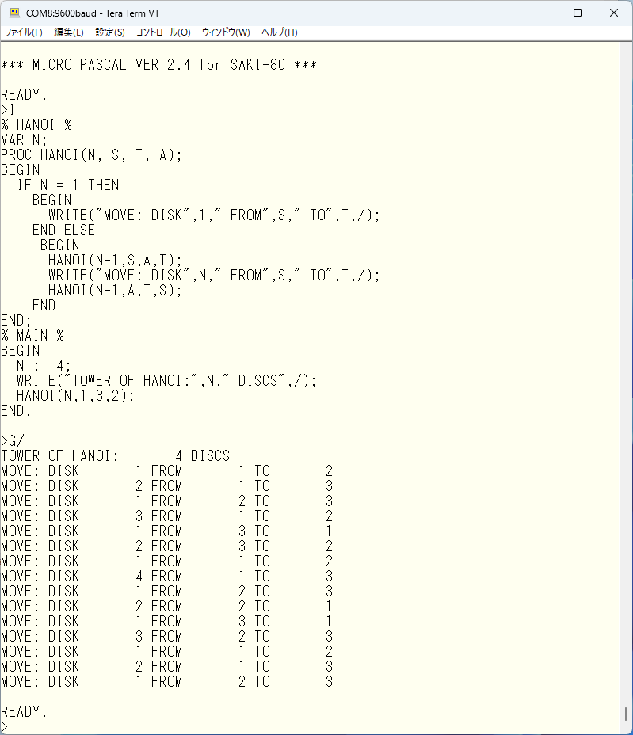

# UNIMON for SAKI80
UNIMON for SAKI80は、asano氏が公開されているUniversal MonitorをベースにAki.H氏による大幅な拡張がなされてEMUZ80用に公開されているEMUZ80_Monitor Rev.B04を Super AKI-80 で動作するよう移植したものです。

## UNIMON 拡張機能
- **L/LG** コマンドによる HEXファイルのロード/実行
- **ミニアセンブラ機能**
- **ディスアセンブラ機能**

など多彩な機能を搭載しています。

UNIMON for SAKI80は、**9600bps/ストップビット1bit/フロー制御なし**でシリアル端末と接続します。SAKI-80は高速動作するため、9600bpsの通信速度であればフロー制御は不要です。そのため、Rev.B04に組み込まれているXON/XOFF制御は使用していません。

## 組み込みソフトウェア
以下のソフトウェアが搭載されています：

- **GRANT's BASIC Ver 4.7b**
- **Tiny Basic**
- **Micro Pascal**

## メモリマップ
UNIMON+各種ソフトウェアは、以下のようなメモリ配置になっています。

これらのバイナリが含まれた saki80mon.hex を、ROMライターで 32KB または 64KB ROMに書き込み、Super AKI-80 にセットして利用します。

使用する ROM はアクセス速度が 100nS以下である必要があります。写真上は EPROM ATMEL 27C256R-45U (32KB,45nS) で、書き込みは1回限りです。 写真下はWinbond W27C512-45 (64KB,45nS)で、複数回の書き込みが可能です。この場合、書き込みオフセットを 8000Hに設定する必要があります。

## BASICの使い方
Super AKI-80 の電源を入れて Tera Term等のシリアル端末と接続し、リセットすると **UNIMON** が起動します。 
**]#L** 
コマンドで上記画面のような組み込まれたソフトウェアの一覧が表示されます。ここで **]#1** のように番号を入力すると、GBASICが起動します。

サンプルの ASCIIART.BASICをテキストエディタで開いて、すべてを選択してコピー&ペーストするとプログラムを Super AKI-80へ送ることができます。**RUN** で実行、**MONITOR** で**UNIMON** へ戻ります。

## Pascalの使い方

**]#4** で **Micro Pascal** が起動します。
**>I** コマンドに続けて、HANOITOWER.pas をBASICと同様にペーストし、**\<CR>**キーを押すとコマンドモードに戻ります。

**>P/** コマンドで全リストを表示 
**>G/** コマンドで実行 
**>Q/** コマンドで UNIMONへ戻る 

Micro Pascal は整数インタープリターですが、構造化プログラミングの神髄を学ぶためには優れたプログラミング言語です。**mpascal.md** に詳しい使い方を説明していますので、それを参考に **Super AKI-80** 上で動かしてみてください。